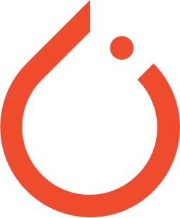
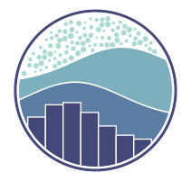

<h1 align="center">&#8287;&#8287;&#8287;&#8287;&#8287;&#8287;&#8287;&#8287; Hello👋 This is Sanjeevan K S   </h1>

<h3 align="center">Frontend Developer & Web Developer from India</h3>

 
  Visitor count 
  

- 🌱 I’m currently learning **Django, Salesforce, DSA**

- 👨‍💻 All of my projects are available at [https://sanjeevan-ks.github.io/](https://sanjeevan-ks.github.io/)

- 📫 How to reach me **sanjeevansuresh02@gmail.com**

- 📄 Know about my experiences [Download Resume](https://drive.google.com/uc?id=1oyfi6kX7cyyBCh9EMlOsx_57fok6hU-i&export=download)

<h3 align="left">Connect with me:</h3>

<h3 align="left">Languages and Tools:</h3>

&nbsp;
&nbsp;
&nbsp;
 &nbsp;

 
 &nbsp;

 &nbsp;
 &nbsp;
 &nbsp;
 &nbsp;
 &nbsp;
 &nbsp;
 &nbsp;
 &nbsp;
 &nbsp;
 &nbsp;
 &nbsp;
 &nbsp;
 &nbsp;
 &nbsp;
 &nbsp;
 &nbsp;

&nbsp;

